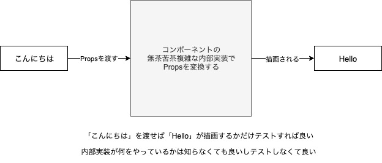

# JestとVue Test Utilsを利用したVueコンポーネントとVuexの単体テストに関して

今回、VueコンポーネントとVuexのテストをするために、以下のライブラリ(フレームワーク)を利用する。

- Jest: テストフレームワーク
- Vue Test Utils: Vueコンポーネントをテストするためのライブラリ

テストフレークは色々存在するが、Jestを利用する。

Vue Test Utilsは必須（他にもVueをテストできるライブラリがあるが現在はこれが主流だと思う）。

## なぜJestを利用するのか

一言で言えば「全部入り」だから。

従来、テストをするためには複数のライブラリを組み合わせて利用する必要があった。

- テストランナー（テストフレームワーク）: テストの構造を作る機能や、テストの実行環境、検証結果のレポート機能などを提供
  - Karma
  - Mocha
  - Jasmine
  - AVA
  - tape
- アサーション: テスト結果が期待通りであるか判定する機能を提供
  - should.js
  - Expect
  - chai
  - power-assert
- テストモック・テストダブル: モック、スタブなどの機能を提供
  - Sinon.js
  - testdouble.js

_※テストランナーとテストフレームワークの定義は文献によって異なったので、今回を一緒のものとする_

自由に組み合わせて利用できる反面、テストの知見がない人にとってはどれを組み合わせれば良いのか判断ができない。また、判断をするためには、それぞれのライブラリをある程度学習する必要があり、そのような手間がテストに対してのモチベーションを低下を招いている。

Jest はそのような悩みを解消したライブラリであり、上記の機能が全て入っている。

そのため、Jest をインストールすれば、すぐにテストコードを書き始められる。

今回に限らず、「テストの興味はあるが、選択肢が多すぎてどれを利用すれば良いのかわからない。」と思っている人々はとりあえず Jest を使ってみれば良いと思う。

## Jestの基本的な使いかた

### インストール

```shell
npm i jest -D
# もしくは
# yarn add jest -D
```

### テスト対象とテストコードの準備

今回テストをするのは、引数を合計する`src/utils/sum.js`

```js
const sum = (number, number2) => number + number2;

export default sum;
```

これをテストする`src/test/utils/sum.spec.js`は以下のようになる。

```js
import sum from '@/utils/sum';

// sumという名前のdescribeブロックを作成する
// 要は「このブロックの中ではsumのテストをするぜ」みたいな宣言のようなもの
describe('sum', () => {
  // テスト内容（期待する動作とそれを確認するためのアサーション）を定義する
  it('adds 1 + 2 to equal 3', () => {
    // 実行するアサーション（テスト結果が期待通りであるか判定する関数）
    expect(sum(1, 2)).toBe(3);
  });
});
```

### テストを実行

オプションや設定ファイルがない状態で`jest`コマンドを実行すれば、デフォルトで以下を検出してテストを実行する。

- `__tests__`ディレクトリ内の`.js`、`.jsx`、`.ts`および`.tsx`ファイルd
- 拡張子が`.test`または`.spec`のファイル（`Component.test.js`や`Component.spec.js`など）
- `test.js`、`spec.js`

そのため、今回は`jest`コマンドを実行するだけで`sum.spec.js`のテストが実行され、以下のような出力になる。

```shell
$ jest
PASS  test/utils/sum.spec.js
  sum
    ✓ adds 1 + 2 to equal 3 (1ms)
```

## Jestの様々な機能

今回、コンポーネントのテストをするためには、モックだけ知っておけばなんとかなるので、それに関してだけ記載する。

### モック関数

テストダブルのスパイにあたる関数。

- 関数（メソッド）が呼び出されたかどうか
- 関数（メソッド）が呼び出された回数
- 関数（メソッド）に渡された実引数

などを検証するために利用する。

テスト対象が依存している、テスト対象以外の関数や外部モジュールのメソッドをモック関数に置き換えることで、テストをしやすくなる。

#### モック関数の利用例

以下の`forEach`関数をテストする。

```js
const forEach = (items, callback) => {
  for (let index = 0; index < items.length; index++) {
    callback(items[index]);
  }
};

export default forEach;
```

`forEach`関数に渡されたコールバックが正しく呼びされているか検証するために、モック関数を生成し、コールバック関数として渡す。

```js
export default forEach;

import forEach from '@/mock-functions/forEach';

describe('forEach', () => {
  it('コールバック関数が正しく呼び出される', () => {
    // モック関数を生成する
    const mockCallback = jest.fn(x => 42 + x);
    forEach([0, 1], mockCallback);

    // モック関数が2回呼ばれたことを期待する
    expect(mockCallback.mock.calls.length).toBe(2);

    // モック関数が初めて呼ばれた時に渡された第1引数は0であることを期待する
    expect(mockCallback.mock.calls[0][0]).toBe(0);

    // モック関数が2回目に呼ばれた時に渡された第1引数は1であることを期待する
    expect(mockCallback.mock.calls[1][0]).toBe(1);

    // モック関数が初めて呼ばれた時の戻り値が42であることを期待する
    expect(mockCallback.mock.results[0].value).toBe(42);
  });
});
```

すべてのモック関数には`.mock`プロパティが存在し、モック関数呼び出し時のデータと、関数の返り値が記録されている。

そのため、関数がどのように呼び出され、どのようにインスタンス化され、返り値が何であったのかを確認することができる。

##### マッチャーを利用して簡潔に書く

上記のテストコードは以下のように`toBe`以外のマッチャーを利用すれば、より簡潔にかける。

```js
// モック関数を生成する
const mockCallback = jest.fn(x => 42 + x);
forEach([0, 1], mockCallback);

// モック関数が2回呼ばれたことを期待する
expect(mockCallback).toHaveBeenCalledTimes(2);

// モック関数が初めて呼ばれた時に渡された第1引数は0であることを期待する
expect(mockCallback).toHaveBeenNthCalledWith(1, 0);

// モック関数が2回目に呼ばれた時に渡された第1引数は1であることを期待する
expect(mockCallback).toHaveBeenNthCalledWith(2, 1);

// モック関数が初めて呼ばれた時の戻り値が42であることを期待する
expect(mockCallback).toHaveNthReturnedWith(1, 42);
```

やっていることは同じであり、糖衣構文という認識で問題ない。

#### モック関数の戻り値を指定する

以下のように`mockReturnValueOnce`を利用すれば呼び出した回数に応じた戻り値を返すことも可能。

```js
const myMock = jest.fn();
console.log(myMock());
// > undefined

myMock
  .mockReturnValueOnce(10)
  .mockReturnValueOnce('x')
  .mockReturnValue(true);

console.log(myMock(), myMock(), myMock(), myMock());
// > 10, 'x', true, true
```

##### なぜモック関数の戻り値を指定するのか

モック関数の戻り値を指定することでテストがやりやすくなるから。

たとえば、以下のテストの場合、`filter()`が期待した値を返すかどうかをテストしたい。

```js
describe('filter', () => {
  it('creates a new array with all elements that pass the test implemented', () => {
    const filterTestFn = jest.fn();
    // １回目の呼び出しは`true`を返し、2回目の呼び出しは`false`を返す
    filterTestFn.mockReturnValueOnce(true).mockReturnValueOnce(false);

    const actual = [11, 12].filter(filterTestFn);

    expect(actual).toEqual([11]);
  });
});
```

本来、この関数に引数として渡すコールバック関数は無茶苦茶複雑かもしれないが、今回はあくまで`filter()`がうまく動作しているかどうかのテストをしたい。

テストをするためには、コールバック関数が`true`か`false`を返せば良いだけなので、モック関数`filterTestFn`を定義し、呼び出し回数に応じた戻り値を指定している。

### モジュールをモックに置き換える

モック関数と同様で、モジュールをモックに置き換えることで、テストがしやすくなる。

#### 外部モジュールをモックに置き換える

以下の`Users`クラスの`all`メソッドをテストする。

```js
import axios from 'axios';

class Users {
  static all() {
    return axios.get('/users.json').then(response => response.data);
  }
}

export default Users;
```

このメソッドは

- 外部モジュールの`axios`
- 外部ファイルの`/users.json`

に依存している。

今回テストをしたいことは、「`all()`メソッドが期待されている値を返すかどうか」である。

より具体的に言えば、「`all()`メソッドが、`axios.get()`がresolveする`respose.data`を返すかどうか」さえ確認できれば良いため、今回は`axios.get()`が何をするのか、`/users.json`はどのような内容なのかは知る必要がない。

そのため、不要な依存を排除してテストをし易くするために、`axios`をモックに置き換え、`get()`メソッドをオーバーライドする。

```js
import axios from 'axios';
import Users from '@/mock-functions/users';

// axiosモジュールをモックにする
jest.mock('axios');
test('should fetch users', async () => {
  // `axios.get`メソッドを`{ data: [{ name: 'Bob' }] }`を返すモック関数にする
  // そのため、`Users.all`メソッド内で実行される`axios.get('/users.json')`は
  // `{ data: [{ name: 'Bob' }] }`を返すようになる
  const users = [{ name: 'Bob' }];
  axios.get.mockResolvedValue({ data: users });
  // ↑は以下の糖衣構文、Promise構文を簡潔に書ける。
  // axios.get.mockImplementation(() => Promise.resolve(resp));

  const response = await Users.all();
  expect(response).toEqual(users);
});
```

## Vueコンポーネントの単体テスト

### コンポーネントの何をテストするのか

[一般的なヒント | Vue Test Utils](https://vue-test-utils.vuejs.org/ja/guides/common-tips.html)では以下のように記載されている。

>UI コンポーネントでは、コンポーネントの内部実装の詳細に集中しすぎて脆弱なテストが発生する可能性があるため、完全なラインベースのカバレッジを目指すことはお勧めしません。

>コンポーネントのパブリックインターフェイスを検証するテストを作成し、内部をブラックボックスとして扱うことをお勧めします。単一のテストケースでは、コンポーネントに提供された入力（ユーザーのやり取りやプロパティの変更）によって、期待される出力（結果の描画またはカスタムイベントの出力）が行われることが示されます。

つまり、コンポーネントのテストの考え方は通常の関数のテストと同じで、入力に対して出力（描画、イベントの発火、メソッドが動作したかなど）が正しいかどうかをテストすれば良い。

コンポーネントに無茶苦茶複雑な内部実装があったとしてもそれはテストする必要はない。

イメージとして以下のような感じ。



### テスト項目

コンポーネントにおいてのテスト項目（入力に対しての出力）は主に以下の通り。

- コンポーネントの描画内容が正しいか
- コンポーネントの属性やクラスが正しいか
- propsが正しく受け取れるか
- methodsが正しく動作するか
- 特定のイベントが発火した際に、正常に動作しているか
- $emitでイベントが正しく発⽕するか
- slotが正しく動作するか

### 単純なボタンコンポーネントのテスト

## Vuexの単体テスト

以下がテスト対象になるが、それぞれはただの関数なので単体テストは容易にできる。

- Mutaions
- Actions
- Getters

### Mutaionsのテスト

以下のMutaionをテストする。

```js
export default {
  SET_POST(state, { post }) {
    state.postIds.push(post.id);
    state.posts = { ...state.posts, [post.id]: post };
  }
};
```

Mutaionに引数を渡してコミットすることで、Stateが正しく変更されているかをテストする。

`SET_POST()`自体はただの関数なので、以下のように通常の関数と同じようにテストできる。

```js
import mutations from '@/store/simple-example/mutations.js';

describe('SET_POST', () => {
  it('state に投稿を追加する ', () => {
    const post = { id: 1, title: 'post' };
    const state = {
      postIds: [],
      posts: {}
    };

    mutations.SET_POST(state, { post });

    expect(state).toEqual({
      postIds: [1],
      posts: { '1': post }
    });
  });
});
```

### Actionsのテスト

以下の動作をするActionをテストする。

1. APIを非同期呼び出しをする
2. データに対して何らかの処理を行う
3. ペイロードとして結果を使ってミューテーションをコミットする

```js
import axios from 'axios';

export default {
  async authenticate({ commit }, { username, password }) {
    try {
      const authenticated = await axios.post('/api/authenticate', {
        username,
        password
      });

      commit('SET_AUTHENTICATED', authenticated);
    } catch (e) {
      throw Error('API Error occurred.');
    }
  }
};
```

このActionに対しては以下のテストをする。

1. 正しいAPIエンドポイントが使用されたかどうか
2. ペイロードは正しいか
3. 正しいミューテーションがコミットされた

今回テストするActionはAPIを呼び出しているが、このAPI呼び出し（`/api/authenticate`）はブラウザ上での呼び出しを想定しているため、テスト実行時はリクエストに失敗し、テスト自体も失敗する。

それを防ぐためにJestの`jest.mock`を利用して、API呼び出しをモックに置き換える。

また、Vuexの依存を排除するために、`commit`もモックに置き換える。

```js
import actions from '@/store/simple-example/actions.js';

let url = '';
let body = {};
let mockError = false;

// axiosモジュールをモックにする
jest.mock('axios', () => ({
  // postメソッドを、Promiseを即時にresolveするようにオーバーライドする
  post: (_url, _body) => {
    return new Promise(resolve => {
      if (mockError) throw Error('Mock error');
      url = _url;
      body = _body;
      resolve(true);
    });
  }
}));

describe('authenticate', () => {
  it('authenticated a user ', async () => {
    // Vuexの依存を排除するために、commitはモックを利用する
    const commit = jest.fn();
    const username = 'alice';
    const password = 'password';

    await actions.authenticate({ commit }, { username, password });

    // axios.post()に渡されたURLが正しいか
    expect(url).toBe('/api/authenticate');
    // axios.post()に渡されたrequest bodyが正しいか
    expect(body).toEqual({ username, password });
    // commitが正しく実行されたか
    expect(commit).toHaveBeenCalledWith('SET_AUTHENTICATED', true);
  });

  it('catches an error', async () => {
    mockError = true;

    await expect(
      actions.authenticate({ commit: jest.fn() }, {})
    ).rejects.toThrow('API Error occurred.');
  });
});
```

### Gettersのテスト

以下のGetterをテストする。

```js
export default {
  poodles: state => {
    return state.dogs.filter(dog => dog.breed === 'poodle');
  },

  poodlesByAge: (state, getters) => age => {
    return getters.poodles.filter(dog => dog.age === age);
  }
};
```

これもMutaionsと同様でただの関数なので、以下のように通常の関数と同じようにテストできる。

```js
import getters from '@/store/simple-example/getters.js';

const dogs = [
  { name: 'lucky', breed: 'poodle', age: 1 },
  { name: 'pochy', breed: 'dalmatian', age: 2 },
  { name: 'blackie', breed: 'poodle', age: 4 }
];
const state = { dogs };

describe('poodles', () => {
  it('returns poodles', () => {
    const actual = getters.poodles(state);
    expect(actual).toEqual([dogs[0], dogs[2]]);
  });

  describe('poodlesByAge', () => {
    it('returns poodles by age', () => {
      const poodles = [dogs[0], dogs[2]];
      const actual = getters.poodlesByAge(state, { poodles })(1);
      expect(actual).toEqual([dogs[0]]);
    });
  });
});
```

`poodlesByAge`は他のGetterに依存しているGetterだが、他のGetterが正しく動いている前提でテストをするので`const poodles = [dogs[0], dogs[2]];`のような固定値を引数に渡して問題ない。

そのため、以下のようなテストをする必要はない。

```js
it('returns poodles by age', () => {
  const poodles = getters.poodles(state);
  const actual = getters.poodlesByAge(state, { poodles })(1);
  expect(actual).toEqual([dogs[0]]);
});
```

この場合、`getters.poodles()`が原因でテストが失敗する可能性があるため、そもそも単体テストになっていない。

## Note

babel7でvue-jestを利用するためには`babel-core@7.0.0-bridge.0`が必要。

- https://github.com/vuejs/vue-jest/issues/160
- https://github.com/vuejs/vue-jest/pull/173/files/21527df0d950b4cfe11e75b16003ca591d270332
